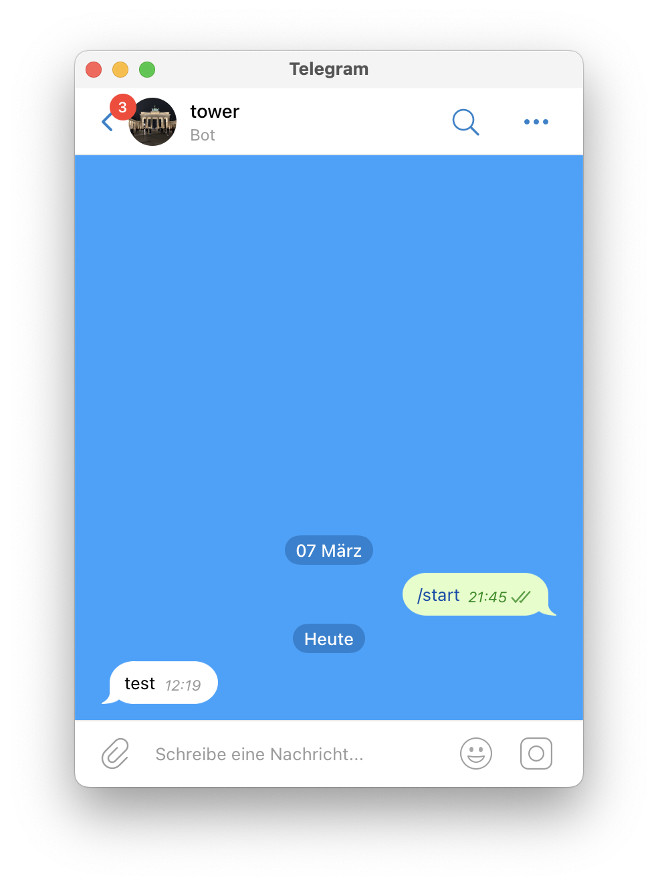

## About

The notification plugin **env\_notify\_telegram** sends a Telegram message
via your bot to any chat as you wish.

For security reasons, its CLI uses environment variables
because they are invisible to other processes.

## Build

Compile like any other Rust program: `cargo build -r`

Find the resulting binary directly under `target/release/`.

## Usage

1. [Create a Telegram bot](https://core.telegram.org/bots#how-do-i-create-a-bot)
   and remember its authentication token, e.g. "4839574812:AAFD39kkdpWt3ywyRZergyOLMaJhac60qc"
2. Start a conversation with the bot via Telegram itself
   using the account to be notified via this program in the future
3. Run (e.g.) `ENTG_TOKEN=4839574812:AAFD39kkdpWt3ywyRZergyOLMaJhac60qc env_notify_telegram`,
   it should show something like this: `[ENTG_CHAT=1424462536] 23h 57m 50s ago: al2klimov: /start`
4. E.g. to notify "al2klimov", run the following command:

```bash
ENTG_TOKEN=4839574812:AAFD39kkdpWt3ywyRZergyOLMaJhac60qc \
  ENTG_CHAT=1424462536 \
  ENTG_MESSAGE=test \
  env_notify_telegram
```

Finally, check your inbox:



One bot (ENTG\_TOKEN) can notify any number of recipients (ENTG\_CHAT).
But when multiple senders don't trust each other, each should have an own bot.
